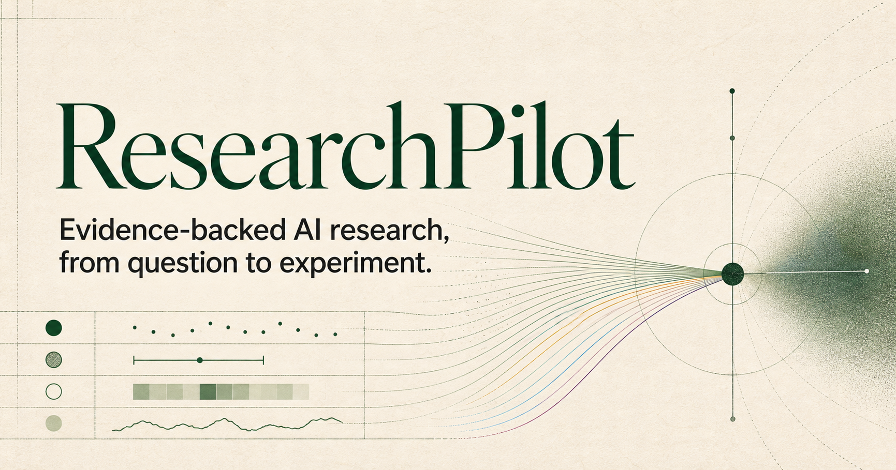
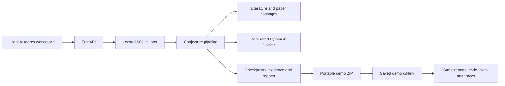

# ResearchPilot

**An inspectable research assistant for mathematical and machine learning conjectures.** ResearchPilot connects literature review, paper reading, controlled experiments, and evidence synthesis. Reports link claims to source passages and recorded measurements, and explain when the evidence is insufficient.



## Explore the demos

The frontend includes three saved investigations. Reviewers can inspect the conjecture, sources, generated Python, plots, report, and trace without a backend or API key.

| Demo | Conjecture being tested | Saved report |
| --- | --- | --- |
| Double descent | Increasing random Fourier features produces an interpolation peak in noisy regression, and ridge regularization reduces that peak. | [Report](frontend/public/demos/double-descent/report.md) |
| Spurious correlations | A predictive shortcut improves in-distribution accuracy but harms generalization when its correlation reverses. | [Report](frontend/public/demos/spurious-correlations/report.md) |
| Overfitting under label noise | Increasing training-set size narrows the gap between noisy-label training accuracy and clean test accuracy. | [Report](frontend/public/demos/overfitting-noise/report.md) |

These are recorded investigations, including their limitations and inconclusive outcomes. A completed run does not mean the conjecture was confirmed. The label-noise demo distinguishes signed and absolute accuracy gaps because training and test labels have different noise levels.

Browse the demo gallery on the Vercel-hosted ResearchPilot website. The gallery is read-only and requires no installation, backend, or API key. Direct demo links use `/?demo=double-descent`, `/?demo=spurious-correlations`, and `/?demo=overfitting-noise`.

To browse the gallery locally or run your own investigations, follow the [local setup guide](frontend/public/demos/local-setup.md).

## How investigations work

Enter a precisely scoped true/false conjecture and optionally attach papers before starting. The pipeline:

1. Interprets the statement and its assumptions.
2. Reasons about the conjecture, searches for corroborating sources, and retrieves additional scholarly literature.
3. Reviews paper passages and separates support, contradiction, qualifications, and related context.
4. Designs a finite numerical test, generates Python and visualization code, and executes it when Docker is configured.
5. Synthesizes the recorded evidence into a qualitative assessment and an inspectable report.

Missing papers, invalid model responses, code-generation failures, and execution failures remain visible in the trace. An attached paper can define a method without supplying evidence for the conjecture. Numerical experiments establish results in the tested setting; they do not prove universal mathematical claims.



The workflow lives in [conjecture_pipeline.py](researchpilot/conjecture_pipeline.py). See the [workflow guide](docs/CONJECTURE_WORKFLOW.md) for stage contracts and the [security model](docs/SECURITY.md) for execution boundaries.

## Local setup

To run your own investigations, follow the [local setup guide](frontend/public/demos/local-setup.md). It covers installation, Docker preparation, API keys, deployment modes, and starting the backend and frontend.

## Save and publish a demo

Runs persist locally in `.researchpilot/`, which is ignored by Git. To preserve a result, use **Report → Save demo ZIP**, or:

```powershell
python -m researchpilot.cli list
python -m researchpilot.cli export-demo RESEARCH_ID --output demos/my-investigation.zip
python -m researchpilot.cli publish-demo demos/my-investigation.zip --slug my-investigation --title "My investigation" --summary "The conjecture and comparison being tested."
```

Review the ZIP before publishing. `publish-demo` verifies its manifest and prepares gallery files under `frontend/public/demos/`; it does not deploy the website. Commit the curated ZIPs and prepared gallery assets. Existing filenames and slugs are protected from overwriting. See the [demo guide](demos/README.md) for the snapshot format and workflow.

For Vercel, select `frontend` as the project root, use the Next.js preset, and set `NEXT_PUBLIC_RESEARCHPILOT_DEMO_ONLY=true` before building. Set `NEXT_PUBLIC_SITE_URL` to the public site URL. The curated gallery works without a deployed backend.

## Verification

Install test dependencies and run the offline suite:

```powershell
python -m pip install -e ".[api,literature,math,dev,identity,telemetry]"
python -m unittest discover -s tests -q
cd frontend
npm test
npm run lint
npm run typecheck
npm run build
```

Tests cover grounding, provider routing, paper ingestion, persistence, API/job behavior, generated experiment handling, portable exports, and frontend presentation. Docker runtime checks require explicit opt-in. The standalone `tests/test_katex_provider.py` tool makes a paid model request only when explicitly run in live mode; ordinary test discovery does not call it.

[Conjecture cases](researchpilot/evaluation_data/conjectures.json) are available for additional evaluation. The `benchmark` CLI command checks historical tool-selection heuristics, not the current pipeline's scientific quality. No historical benchmark percentage is claimed as current performance.

Search coverage and PDF parsing are incomplete; image-only papers may need OCR. Generated experiments and model assessments need human review. See the [remaining work](docs/ROADMAP.md) and [MIT license](LICENSE).
